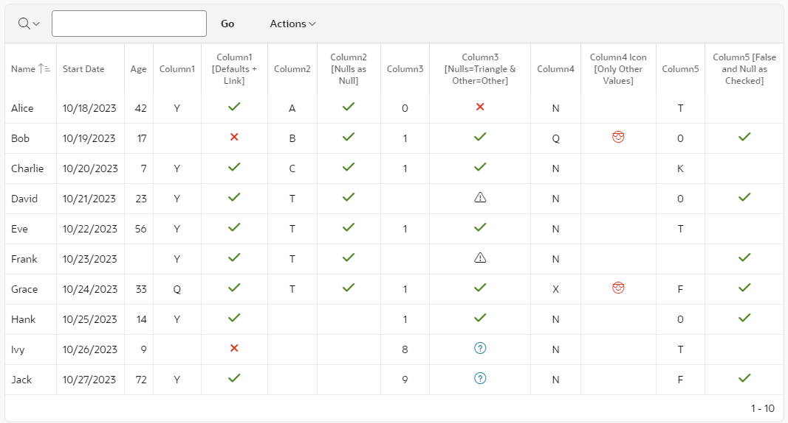
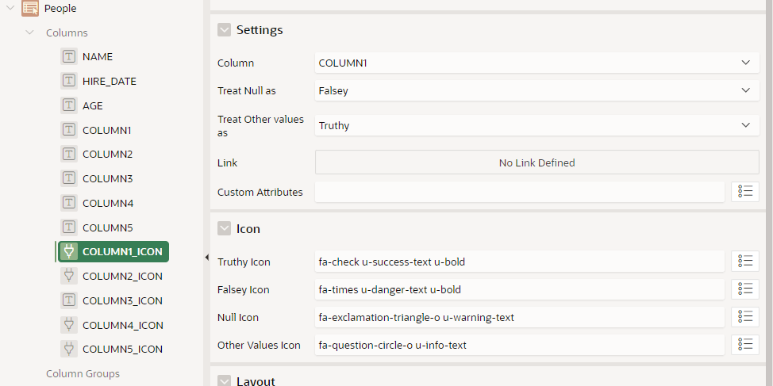
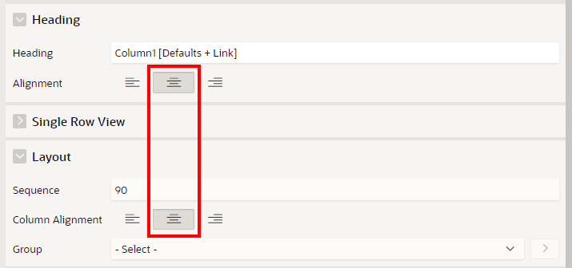

# Check Marks Template Component

Displays Truthy (T, Y, 1) & Falsey (F, N, 0) Template Directive Values as an Icon with alternative icons for Null and Other values

- Usable as a Single

## Preview Image



## Default Evaluation of values

Any Column defined in the settings will have its value evaluated using the default evaluation rule below. Nulls and Other values (i.e Not Nulls) can be treat separately.

See the [Template Directives Section](https://apex.oracle.com/pls/apex/r/apex_pm/ut/template-directives) of the [Univseral Theme](https://apex.oracle.com/ut) app for how values are evaluated.

| Truthy               | Falsey                                                                  |
|-----------------------|------------------------------------------------------------------------|
| Not Null                | Null                        |
| T                       | F                           |
| Y                       | N                           |
| 1                       | 0                           |


## Settings



| Name               | Value                                                                  |
|-----------------------|------------------------------------------------------------------------|
| Column                | The Column containing Truthy (T, Y, 1) & Falsey (F, N, 0) values       |
| Treat Null as         | Any Nulls can be assigned to any Icon                                  |
| Treat Other Values as | Any other values can be assigned to any Icon                           |
| Link                  | Link when clicked                                                      |
| Custom Attributes     | Custom Attributes e.g. for a tooltip try title="Hello"                 |
| Truthy Icon           | Icon to display if value is Truthy (or treat as Truthy)                |
| Falsey Icon           | Icon to display if value is Falsey (or treat as Falsey)                |
| Null Icon             | Icon to display if value is Null (or treat as Null)                    |
| Other Values Icon     | Icon to display if value is any other Value (or treat as Other Values) |


## Demo Application
You can find a Demo Application [here](https://apex.oracle.com/pls/apex/r/luf/check-marks).


In the Demo Application, the following Plug-in Settings are used

| Setting               | Column1                          | Column2                          | Column3                          | Column4                     | Column5                        |
|-----------------------|----------------------------------|----------------------------------|----------------------------------|-----------------------------|--------------------------------|
| Column                | COLUMN1                          | COLUMN2                          | COLUMN3                          | COLUMN4                     | COLUMN5                        |
| Treat Null as         | Falsey                           | Null                             | Null                             | Null                        | Falsey                         |
| Treat Other Values as | Truthy                           | Truthy                           | Other                            | Other                       | Null                           |
| Link                  | Page 3                           |                                  |                                  |                             |                                |
| Custom Attributes     |                                  | title="Hello #NAME#"             |                                  |                             |                                |
| Truthy Icon           | fa-check u-success-text u-bold   | fa-check u-success-text u-bold   | fa-check u-success-text u-bold   |                             |                                |
| Falsey Icon           | fa-times u-danger-text u-bold    | fa-times u-danger-text u-bold    | fa-times u-danger-text u-bold    |                             | fa-check u-success-text u-bold |
| Null Icon             | fa-exclamation-triangle-o        |                                  | fa-exclamation-triangle-o        |                             |                                |
| Other Values Icon     | fa-question-circle-o u-info-text | fa-question-circle-o u-info-text | fa-question-circle-o u-info-text | fa-emoji-cool u-danger-text |                                |

## Installation
1. Download the plug-in file from the latest release
2. Import the plug-in file into your application

## Usage

There are two usage methods for IR Columns. 
  - The Plugin Method is easiest to configure however users will **not** be able to sort or filter the column.
  - The HTML Expression Method is more advanced to configure however users will be able to sort or filter the column.


### Plugin Method

1. Assign an IR Column to Type **Check Marks**
2. Within the plugin settings, assign the "Column" to the Column containing Truthy (T, Y, 1) & Falsey (F, N, 0) values
3. Keep all the other settings as default or change as required

### HTML Expression Method

1. Assign the HTML Expression of the IR Column to the sample code below, changing #COLUMN1# to the column containing Truthy (T, Y, 1) & Falsey (F, N, 0) values

    ```
    {with/}
        COLUMN:=#COLUMN1#
        TREAT_NULL_AS:=FALSEY
        TREAT_NOT_NULL_AS:=TRUTHY
        LINK:=
        CUSTOM_ATTRIBUTES:=
        TRUTHY_ICON:=fa-check u-success-text u-bold
        FALSEY_ICON:=fa-times u-danger-text u-bold
        NULL_ICON:=fa-exclamation-triangle-o u-warning-text
        OTHER_VALUES_ICON:=fa-question-circle-o u-info-text
    {apply APEX.LUFCMATTYLAD.CHECK_MARKS/}
    ```

2. Change above settings as required

For Internal links, you can use expressions like this
```
LINK:=f?p=&APP_ID.:3:&APP_SESSION.::NO:RP:P3_NAME:#NAME#
```
or call a JavaScript like this
```
LINK:=javascript:apex.message.alert("MOT")
```

## Tips

The Check Marks Template Component looks best when both the IR Column **Heading Alignment** & **Column Alignment** are center Aligned



## Sample SQL

The SQL Statement for the [Demo Application](https://apex.oracle.com/pls/apex/r/luf/check-marks) is

```
WITH json_data AS (
  SELECT '[
    {"name": "Alice", "date": "2023-10-18", "number": 42, "column1": "Y", "column2": "A", "column3": 0, "column4": "N", "column5": "T"},
    {"name": "Bob", "date": "2023-10-19", "number": 17, "column1": null, "column2": "B", "column3": 1, "column4": "Q", "column5": "0"},
    {"name": "Charlie", "date": "2023-10-20", "number": 7, "column1": "Y", "column2": "C", "column3": 1, "column4": "N", "column5": "K"},
    {"name": "David", "date": "2023-10-21", "number": 23, "column1": "Y", "column2": "T", "column3": null, "column4": "N", "column5": "0"},
    {"name": "Eve", "date": "2023-10-22", "number": 56, "column1": "Y", "column2": "T", "column3": 1, "column4": "N", "column5": "T"},
    {"name": "Frank", "date": "2023-10-23", "number": null, "column1": "Y", "column2": "T", "column3": null, "column4": "N", "column5": null},
    {"name": "Grace", "date": "2023-10-24", "number": 33, "column1": "Q", "column2": "T", "column3": 1, "column4": "X", "column5": "F"},
    {"name": "Hank", "date": "2023-10-25", "number": 14, "column1": "Y", "column2": null, "column3": 1, "column4": "N", "column5": 0},
    {"name": "Ivy", "date": "2023-10-26", "number": 9, "column1": null, "column2": null, "column3": 8, "column4": "N", "column5": "T"},
    {"name": "Jack", "date": "2023-10-27", "number": 72, "column1": "Y", "column2": null, "column3": 9, "column4": "N", "column5": "F"}
  ]' AS json_doc
  FROM dual
)
SELECT
  jt.*,
  column1 column1_icon,
  column2 column2_icon,
  column3 column3_icon,
  column4 column4_icon,
  column5 column5_icon
FROM 
  json_data j,
  JSON_TABLE(j.json_doc, '$[*]'
    COLUMNS (
      name VARCHAR2(50) PATH '$.name',
      hire_date timestamp  PATH '$.date',
      age NUMBER PATH '$.number',
      column1 VARCHAR2(1) PATH '$.column1',
      column2 VARCHAR2(1) PATH '$.column2',
      column3 NUMBER PATH '$.column3',
      column4 VARCHAR2(1) PATH '$.column4',
      column5 VARCHAR2(1) PATH '$.column5'
    )
  ) jt
```

## Version History

### 23.2.2 (Dec 2023)

#### Fixes
- Lowercase t & y now recognised as Truthy

### 23.2.1 (Oct 2023)
- Initial Release

## Donations

Donations to [Saint Michael's Hospice](https://saintmichaelshospice.org/support-our-work/donate/one-off-donation/) are welcome
